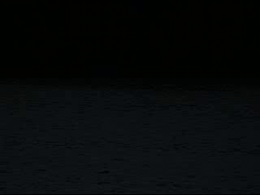

# Background Subtraction

Various background subtraction models are designed using classical computer vision methods for different type of video sequences like those with static background, moving background, changing illumination background, etc. The problem statement can be found [here](./Assignment_1.pdf) and detailed discussion can be found [here](./Report.pdf).

## Different Scene Categories

We build system for static, illumination, jitter, moving, and pan-tilt-zoom scene categories. 




## Running Mode

Generate the prediction masks

```bash
python main.py  --inp_path=<path to input frames> --out_path=<path to generated masks> --eval_frames=<path to eval_frames.txt file> --category="<b/i/j/m/p>"
```

Evaluate the prediction masks against ground truth

```bash
python eval.py  --pred_path=<path to generated masks folder> --gt_path=<path to groundtruth masks folder>
```

Generate video containing foreground using original frames and corresponding masks

```
python makevideo.py --imgs_path=<path to input frames> --masks_path=<path to masks> --video_path=<path to save video> --eval_frames=<path to eval_frames.txt file> 
```

## Authors

- [Shubham Mittal](https://www.linkedin.com/in/shubham-mittal-6a8644165/)
- [Aditi Khandelwal](https://www.linkedin.com/in/aditi-khandelwal-991b1b19b/)

Course assignment in Computer Vision course ([course webpage](https://www.cse.iitd.ac.in/~chetan/teaching/col780-2020.html)) taken by [Prof. Chetan Arora](https://www.cse.iitd.ac.in/~chetan)
